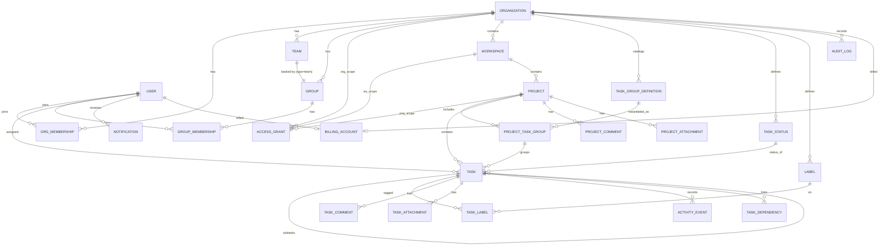

# AI-Native Task Management — Domain Data Model

> **Status:** Phase-1 model finalized (from the data-model design review).
> **Companion doc:** The architecture and stack are in
> [`ai-native-system-design.md`](./ai-native-system-design.md). This doc defines **what data exists and
> how it relates** — conceptual, not physical DDL.

---

## 1. Scope

The conceptual data model: entities, relationships, and tenancy rules. Everything here is **Phase 1**
unless tagged **[P2]** (Phase 2 — MCP/chat/retrieval), **[★]** (north-star, deferred), or **[defer]**.
Physical concerns (column types, indexes, DDL) come in implementation planning.

## 2. Tenancy — the Organization boundary

**The Organization is the top tenant + billing boundary.** All org-scoped data carries an
`organization_id`, and **PostgreSQL row-level security is enforced on `organization_id` across every
org-scoped table** — not selectively. A missing `WHERE` clause must never leak across organizations.

- **Workspace** is a *logical container inside* an org (grouping projects) — **not** the tenant boundary.
- **User is global** (one identity per person, identified by unique **username**, **email**, and **mobile
  number**; passwordless OTP login — see below); a user joins orgs via `OrgMembership` and can belong to
  many. Users are the one non-org-scoped entity.

> Correction vs. earlier drafts: the tenant boundary moved from Workspace → **Organization**. The
> system-design doc has been updated to match.

## 3. People & Access

### Entities
| Entity | Purpose |
| --- | --- |
| **Organization** | Top tenant + billing boundary. |
| **User** | Global person identity: unique **username**, **email**, **mobile number**. Passwordless **OTP** login. |
| **OrgMembership** | Records that a User belongs to an Organization. |
| **Team** | An org unit / named group of people (e.g., "Engineering"). A user can be in many teams. |
| **Group** | The **permission principal**. Has `type` = **`team`** (auto-created 1:1 with a Team, `team_id` set, name synced) or **`custom`** (owner-created, members from anywhere in the org). |
| **GroupMembership** | Records that a User belongs to a Group. |
| **AccessGrant** | The single permission record: **principal** (User *or* Group) × **scope** (Org / Workspace / Project + id) × **Role**. |
| **OneTimeCode** | Short-lived login OTP: target (email/mobile), **hashed** code, channel, `expires_at` (~5–10 min), attempt count, consumed flag. |
| **Session** | An active login session for a User (issued after OTP verify): token, `expires_at` (N days), revocable. This is the identity every door validates. |

### Roles (fixed catalog — not customizable)
`Owner` (all, incl. billing + delete) · `Admin` (manage members/teams/groups/projects; no billing) ·
`Member` (create/edit projects & tasks within access) · `Viewer` (read-only). No Guest.

### How permission resolves
- **AccessGrant is the only mechanism** for assigning a role, at any scope, to a user or a group.
  `OrgMembership` / `GroupMembership` record *belonging* only; the role comes from grants.
- **Inheritance flows downward:** Org grant → all its workspaces/projects; Workspace grant → its projects;
  Project grant → local.
- **Additive (union):** a user's effective access at any object = the **most permissive** grant reaching
  them via their own grants *plus* all their groups' grants.
- **Default-on-create:** when a Member creates a Workspace or Project, the system auto-adds AccessGrants
  for **all `type=team` groups the creator belongs to** — never their `custom` groups. (The `team` flag on
  Group is what drives this.) If the creator is in multiple teams, all their team-groups get access; there
  is no primary/secondary team distinction.

## 4. Work & Tasks

### Entities
| Entity | Purpose |
| --- | --- |
| **Workspace** | Logical container grouping projects, inside an org. |
| **Project** | Container for task groups + tasks. |
| **TaskGroupDefinition** | **Org-level catalog** of task groups (sections). Each has an `is_default` flag + order; Owner/Admin-managed in Settings (like TaskStatus). |
| **ProjectTaskGroup** | A task group active in a specific project (→ a TaskGroupDefinition). On project create, all `is_default` definitions are attached; users add more via an **"Add" dropdown** of the org catalog. **No stored status** — rollup computed at runtime. |
| **Task** | The core work unit. |
| **TaskStatus** | **Org-level** status catalog (e.g., To Do · In Progress · Blocked · Done · Cancelled). Only **Owner** edits it (Settings). Each status has an `is_completed` marker so rollups know which statuses mean "done." |
| **Label** | Org-level tag; many-to-many with Task via **TaskLabel**. |
| **TaskDependency** | "blocks / blocked-by" edge between two tasks. **[optional]** |

### TaskGroup rollup (runtime, not stored)
A ProjectTaskGroup stores no status. At display/report time it aggregates its tasks: shows **per-status
counts**, and shows **"Completed"** when *all* its tasks are in an `is_completed` status. Purely computed.

### Project page: tabs & permissions surface
- **Project tabs** — **List** (grouped by task group) · **Kanban** (columns by **status**) · **Gantt**
  (timeline by dates) · **Attachments** · **Discussions** · **Security/Settings**. List/Kanban/Gantt are
  **UI render modes over the same tasks** (not stored entities); persisted custom saved views remain
  **[later]** (§8). The **Attachments** tab shows **ProjectAttachments** and **Discussions** shows
  **ProjectComments** — project-level, kept **separate** from task-level (§5).
- **Permissions surface** — the project's **security icon** manages **project-scope AccessGrants** to
  Groups (or users). No new entity; it is `AccessGrant` at Project scope (§3). Org- and Workspace-level
  Settings pages similarly surface grants + catalogs at those scopes.

### Task fields (Phase 1 unless noted)
| Group | Fields |
| --- | --- |
| **Identity** | `id` · `title` · `description` (rich text) |
| **Placement** | `project` · `project_task_group` (section) · `rank` (manual order within group) |
| **Classification** | `status` (→ TaskStatus) · `priority` (None/Low/Med/High/Urgent) · `labels` (→ TaskLabel) · `milestone` flag **[optional]** |
| **People** | `assignee` — **single User**, must have access to the project · `created_by` · `watchers` **[optional]** |
| **Scheduling** | `due_date` · `completed_at` · `start_date` **[optional]** · `recurrence` **[optional]** |
| **Hierarchy & links** | `parent_task` (self-referential → subtasks) · `dependencies` **[optional]** |
| **Effort** | `estimate` · `time_tracked` **[both optional]** |
| **Content** | `attachments` · `comments` · `checklist` **[optional]** |
| **System** | `created_at` · `updated_at` |

**Decided:** single assignee (not multi); **no custom fields**; subtasks are Tasks with a `parent_task`.

## 5. Collaboration & Activity

Comments and attachments are **kept separate for Tasks and Projects** — a task's pane shows only its own;
a project's Discussions/Attachments tabs show only the project's. Not polymorphic, not aggregated.

| Entity | Purpose |
| --- | --- |
| **TaskComment** | On a **task**; author, rich-text body, timestamps. **Flat (no threading)**; `@mentions` trigger a Notification; authors edit/delete their own. |
| **ProjectComment** | On a **project** (the Discussions tab); same shape as TaskComment. |
| **TaskAttachment** | On a **task**; **file** (object storage) *or* **URL link**; name, uploader, timestamp. |
| **ProjectAttachment** | On a **project** (the Attachments tab); same shape as TaskAttachment. |
| **ActivityEvent** | Immutable, **auto-generated by REST** on task changes (created, status/assignee/due changed, …); feeds the task's activity history. |

## 6. Platform

| Entity | Purpose |
| --- | --- |
| **Notification** | Recipient, type, reference (task/comment), read/unread, timestamp. **Created inline in REST** (no event bus). Event-based only in P1; time-based reminders wait for the deferred scheduler. |
| **AuditLog** | **Minimal**: actor, action, target, timestamp; org-scoped. (In P2 this is also where tool calls land.) |
| **UserPreference** | Per-user UI prefs (e.g., **theme** dark/light). Small; may be client-local in P1 but persisted so it follows the user across devices. Not org-scoped (tied to the global User). |
| **BillingAccount** **[defer wiring]** | Subscription state; **subscriber is a User (Pro, individual) or an Organization (flat org fee)**. Holds `plan`, `status`, and Stripe refs. **Entity/stub only in P1** (default plan); Stripe Checkout + webhooks + feature-gating added at monetization. No usage-based billing. |

## 7. Entity-Relationship Diagram (Phase 1)

*`AccessGrant` is polymorphic on both ends (principal = User|Group, scope = Org|Workspace|Project) — shown
above as separate scope relationships for readability.*

## 8. Deferred / Later Entities

| Entity | Disposition |
| --- | --- |
| **Conversation**, **Message** | **[P2]** — chat/voice history. |
| **EmbeddingChunk** | **[P2]** — pgvector slices for "ask anything" retrieval; permission-scoped like everything else. |
| **Agent**, **AgentRun** | **[★]** — autonomous scheduled agents. |
| **Automation**, **IntegrationConnection** | **[★/later]** — rules & external integrations. |
| **View** (saved list/board/calendar lens) | **[later]** — P1 renders views in the UI; persisted custom views come later. |
| **ToolCall** | Folded into **AuditLog** for now. |
| **ToolDefinition** | **Not a table** — tools live in code / the MCP server. |
| **ApprovalRequest** | **Dropped** — replaced by the `confirm` flag at REST (see system design §6). |

## 9. Open Questions

- **Label scope** — org-wide (as modeled) vs. per-workspace/project? Currently org-level.
- **Task-group catalog management** — assumed **Owner/Admin** manage the org-level `TaskGroupDefinition`
  catalog in Settings (mirroring TaskStatus). Confirm who can add catalog entries.
- **Retention** — windows/archival for high-volume append-only tables (ActivityEvent, AuditLog; later Message).
