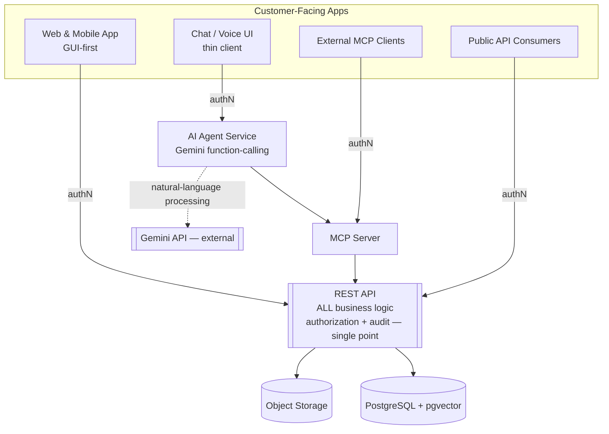

# AI-Native Task Management — System Design & Tech Stack

> **Status:** Finalized architecture direction (from the component-by-component design review).
> **Companion doc:** Entities, relationships, and multi-tenancy rules are defined in
> [`ai-native-data-model.md`](./ai-native-data-model.md). That doc still needs reconciliation against the
> decisions below (see §12).
> **Relationship to prior doc:** This supersedes `ai-native-task-management-architecture.md`. The product
> vision and stack shortlist there still hold. The architecture here is more concrete: a **REST API holds
> all business logic, authorization, and audit**; **MCP wraps REST** as a first-class tool surface; and an
> **AI agent service** drives chat/voice by calling MCP tools. Every surface converges on the one REST API.

---

## 1. Vision

A modern, **AI-first** task management SaaS. It is **GUI-first** — a polished web/mobile app is the
primary experience — with an always-available **natural-language layer** (chat, and later voice) that can
do anything the app can do, plus **MCP** so external AI clients and agents operate on the same governed
tools. The guiding principle: **all functionality is defined once in the REST API, and every other
surface routes through it** under one authentication and authorization model.

## 2. Architecture at a Glance

Three entry patterns, all converging on one REST API:

- **Deterministic actions** (GUI clicks, drag-drop, forms; the Public API) call **REST directly**.
- **Natural language** (chat, voice) goes to the **AI Agent service**, which selects tools and calls them
  **via MCP → REST**.
- **External AI clients** call **MCP → REST**.



Everything is a client of REST. **No surface touches the database or business logic directly** — not the
GUI, not MCP, not the agent. That is what makes one authorization path and one audit trail possible.

## 3. The One API (REST)

- **REST holds all business logic.** Tasks, projects, comments, search, billing — every capability is a
  REST endpoint. Nothing is reimplemented elsewhere.
- **Authorization lives only here.** The fine-grained decision "can *this* user do *this* to *this*
  object?" is made in REST and nowhere else, so no client can drift from it.
- **Audit lives here.** Every mutation is recorded (see §9 for scope).
- **MCP and the agent are thin.** MCP maps tool schemas to REST calls; the agent maps prompts to tool
  choices. Neither owns business rules or permission logic.

## 4. Authentication & Authorization

The distinction that keeps this safe: **authentication** (who are you?) is checked at **every entry**;
**authorization** (are you allowed to do this specific thing?) is decided **only in REST**.

```
        ┌──────── one authentication mechanism, enforced at each door ────────┐
GUI / Public API ─►│ authN ─► REST ─────────────────► DB                       │
External MCP client ─►│ authN ─► MCP ─► REST ────────► DB                       │
Chat / voice ─►│ authN + rate-limit + coarse check ─► Agent ─► MCP ─► REST ─► DB│
        └─────────────────────────────────────────────────────────────────────┘
                              REST = authorization + audit (single point)
```

**Method — passwordless OTP (custom, no managed provider).** A user identifies with their **username,
email, or mobile number**; a **one-time code** is sent to their email or mobile; on verifying it they
receive a **session token valid for N days** (renewable, revocable). That token is what every door
validates. *Because auth is built in-house, these are mandatory:* short OTP expiry (~5–10 min),
per-identifier + per-IP **rate limits**, max verify **attempts**, and protection against SMS-pumping cost
abuse.

- **Authentication at every door.** REST is called directly by the GUI, so it cannot assume an upstream
  check — it authenticates every request. Recommended arrangement: a **shared auth gateway / middleware**
  validates the token once for all inbound traffic (GUI→REST, external→MCP, chat→Agent); each service
  then trusts that identity. One mechanism, not one per service.
- **The agent acts *as the user*.** The user's identity propagates `agent → MCP → REST`. A chat action is
  authorized *identically* to the same action in the GUI. **The agent has no standing privileges of its
  own** — no god-mode service account.
- **Fail fast before spending money.** At the chat edge: reject anonymous/invalid callers, **rate-limit**,
  and run a **cheap coarse check** (workspace membership, AI entitlement) *before* any LLM call. The
  authoritative per-object decision still happens at REST.

## 5. MCP Layer

- **MCP is a first-class product surface**, a separate service that **wraps REST** — every MCP tool call
  routes through REST's authorization and audit. No weaker path for AI/agents.
- **Your own chat dogfoods MCP.** The agent reaches tools *only* through MCP — the same surface external
  clients use — so the MCP product can never be incomplete or out of sync; your chat depends on it.
- Transport: **Streamable HTTP** (current MCP standard).

## 6. The AI Brain (Agent Service)

Powers chat now, voice later. The **client is thin** (captures input, sends it with the user's token,
renders the streamed reply); **the agent service holds all the intelligence and tool access.**

- **Model: Gemini with function calling.** MCP tools are passed to Gemini as function declarations; Gemini
  picks a tool; the agent executes it via MCP → REST. **Single provider for now** — no multi-model
  abstraction — but the **model endpoint is configurable**, and model choice is a **per-workspace setting**
  (this doubles as the compliance escape-hatch: a strict customer can be pointed at an in-boundary model
  without code changes).
- **Simple tool-calling loop.** The model calls tools iteratively until the request is satisfied. No
  explicit planner for now.
- **Memory: current conversation only.** No cross-session or workspace-learned memory yet. (Long chats
  will need in-session truncation/summarization — an implementation detail.)
- **One general chat agent** holding all the user's permitted tools (not routed to specialized sub-agents).
- **Confirmation for destructive/bulk actions — two layers:**
  - *Agent (UX):* asks "are you sure?" in the conversation; on yes, sets `confirm: true`.
  - *REST (authoritative):* destructive/bulk tools **require `confirm: true`** and reject any call without
    it — from *any* caller (chat agent, external MCP client). Cheap, non-interactive, unbypassable.
- **Reusable entry point:** the agent should be invocable as "run *this prompt* as *this user*," not only
  "handle this live chat turn." (This is what makes scheduled/autonomous runs cheap to add later — §8.)

## 7. Retrieval — "Ask Anything"

Answering "what's at risk this week?" is just the agent calling **read tools** exposed via MCP. Structured
questions map to filtered REST queries; fuzzy/semantic questions use **pgvector** search — always
**permission-scoped at the source** (retrieval enforces the same authorization as every other tool, so it
can never surface data the asker can't see). Retrieval is not a separate path; it's read tools.

## 8. Autonomous Agents — ★ North-Star (design captured, **not built now**)

An autonomous agent is the **same agent engine** (§6), triggered by a **schedule** instead of a live
prompt. The design is decided so we don't foreclose it, but it is **out of near-term scope**:

- **Generic scheduled prompts, not hardcoded agent types.** The user attaches a **schedule to any
  natural-language prompt** (`"weekday 8am: summarize my overdue tasks"`). "Standup / triage / follow-up"
  agents are just saved prompt templates over one primitive: `(prompt + schedule + user) → run the agent`.
- **Runs as the configuring user's identity**, with permissions **re-checked at run time**.
- **Executes directly, skips unsafe actions.** With no human to confirm, a scheduled run never sets
  `confirm: true`, so REST automatically rejects destructive/bulk tools — "skip if unsafe" falls out of
  the §6 mechanism for free.
- **Cheap to add later:** a scheduler (cron) + a store of `(prompt, schedule, user)` + a runner that
  invokes the existing agent entry point. The hard part (the tool-calling brain) is already built for chat.

## 9. Realtime & Eventing — ★ North-Star (**not built now**)

For now, **users refresh the screen** to see changes (including those made by the agent). No WebSocket
gateway, no event bus, no presence.

- When wanted, the design is event-driven: **REST emits a domain event on each write → a WebSocket gateway
  (Redis pub/sub) fans out** to connected clients. Live task updates, notifications, agent streaming, then
  presence.
- *Structural note for now (no build):* keep all DB writes behind **REST service functions** so emitting
  events later is a localized change, not a codebase-wide retrofit.

## 10. Governance, Safety & Cost

Mostly decided across the sections above; the near-term scope:

- **Audit — minimal at first:** record *who did what* from Phase 1; enrich with surface and before/after
  state later.
- **LLM cost — unmetered for now, with a placeholder hook** so per-workspace quotas/rate-limits drop in
  later without rework. (Basic edge rate-limiting from §4 still applies.)
- **Admin AI on/off — Phase 2:** a workspace-level flag to disable AI/MCP, shipping with chat.
- **PII/secret redaction — accepted gap for now:** task content is sent raw to Gemini. Documented risk;
  strict customers are covered by the per-workspace in-boundary model option (§6).

## 11. Stack

| Area | Choice |
| --- | --- |
| Backend | Python + FastAPI, **modular monolith** (REST + MCP module + agent service) |
| Web / Mobile | Next.js + TypeScript · React Native (Expo) |
| Database | PostgreSQL + **pgvector** (RLS mandatory on `organization_id` — **Organization is the tenant boundary**; see data model) |
| Object storage | Azure Blob Storage (attachments, and later audio) |
| NLP / LLM | **Gemini** (function calling now; **Gemini Live** for voice in Phase 3) — the only component outside the Azure boundary |
| MCP | Python service wrapping REST, over Streamable HTTP |
| Auth | **Custom passwordless OTP** (username/email/mobile → one-time code → session token, valid N days). Needs an **SMS provider** + an **email provider** for delivery (console-print in dev). No managed provider. |
| Billing | Stripe |
| Cloud / hosting | **Azure** — Container Apps + managed Postgres + Blob + Key Vault + Monitor |
| Deferred until needed | Redis + WebSocket gateway (realtime), Meilisearch (start with Postgres FT + pgvector), Celery/scheduler (autonomous agents) |

Continue to **avoid** Kubernetes, Kafka, Temporal, GraphQL, and microservices until a concrete need appears.

## 12. Frontend & UX Conventions

Product-level UX requirements that shape the web/mobile client. These are **rendering/interaction
concerns** — they map onto existing Task fields and add no new backend surfaces:

- **Drag-and-drop tasks in every view:**
  - **List** — reorder within a task group and move between task groups.
  - **Kanban** — drag a card across **status** columns (changes `status`).
  - **Gantt** — drag/resize to change **schedule** (`start_date` / `due_date`).
  - All of the above map to existing fields (`rank`, `status`, `project_task_group`, dates). The `rank`
    field provides stable manual ordering.
- **Task detail pane** — clicking a task opens a **side pane** to view/edit its details inline (not a
  full-page navigation).
- **Collapsible left master menu** — the primary navigation expands/collapses.
- **Theme toggle** — a **dark/light** switch in the left menu. Persist as a **per-user preference** so it
  follows the user across devices (a small `UserPreference` — see data model); menu collapsed-state can be
  client-local.

### Navigation & information architecture
Drill-down, with a settings surface at each level:
- **Organization** → lists its **Workspaces** + a **settings icon** → **Org Settings** (status catalog,
  task-group catalog, members, teams, groups, roles/grants, billing).
- **Workspace** → lists its **Projects** + a **settings button** → **Workspace Settings** (workspace-scoped
  config & permissions).
- **Project** → tabbed detail: **List** (default — task groups + tasks) · **Kanban** (by status) ·
  **Gantt** (by dates) · **Attachments** · **Discussions** · **Security/Settings** (project-scope
  permissions). Extensible with more tabs later.

## 13. Phased Build Plan

| Phase | Scope |
| --- | --- |
| **Phase 1** | **GUI web app → REST API (business logic + authorization + audit) → PostgreSQL.** Auth (managed provider). This is the foundation; the GUI is REST's first client. |
| **Phase 2** | **MCP server** (wraps REST) · **AI agent service** (Gemini function-calling, one general chat agent) · **web chat** · **retrieval / "ask anything"** · workspace **AI on/off** flag. |
| **Phase 3** | **Voice** (Gemini Live streaming, in-app voice button) · **mobile app**. |
| **★ North-star** | Autonomous agents (scheduled prompts) · realtime & eventing · presence · cross-session memory · LLM cost metering · richer audit · PII redaction. |

**Follow-up:** reconcile `ai-native-data-model.md` with these decisions — e.g., an explicit
`ApprovalRequest` workflow may be dropped in favor of the `confirm` flag; `Agent`/`AgentRun` and
`EmbeddingChunk` map to deferred phases; confirm what's needed for Phase 1 tables vs. later.

## 14. Decisions Still Open

- **OTP delivery providers** — pick an SMS provider and an email provider (e.g., Azure Communication
  Services, Twilio, SendGrid). Not needed until end-to-end testing; dev prints codes to the console.
- **Target segment** — individual / SMB / teams / enterprise (drives how early RBAC depth, SSO/SCIM, and
  residency requirements arrive).
- **Public API scope & versioning** — is it the same REST surface published externally, and on what terms.
- **MCP access tier** — available to all users or gated to paid/admin plans.
