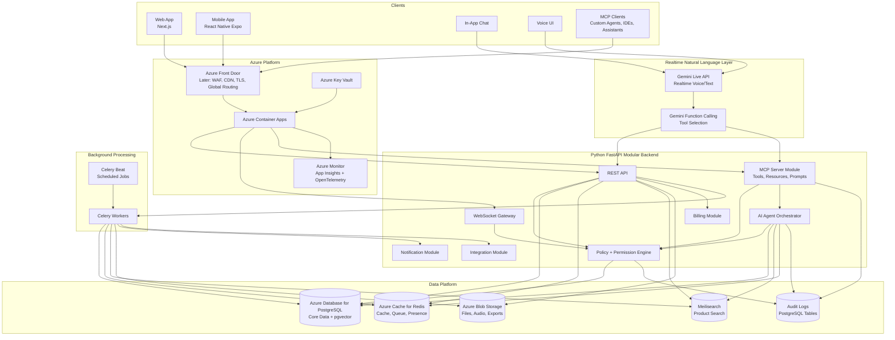
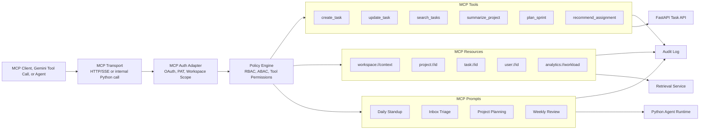
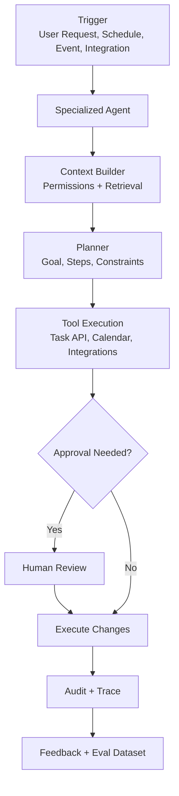
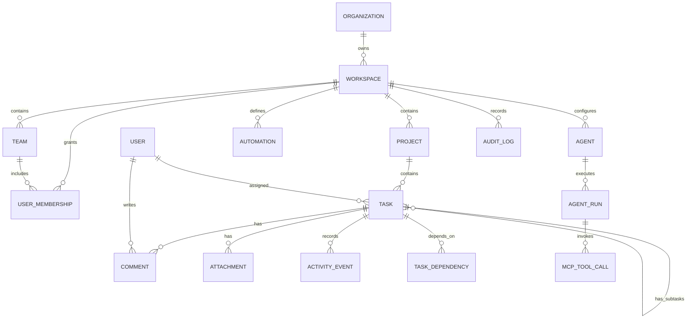
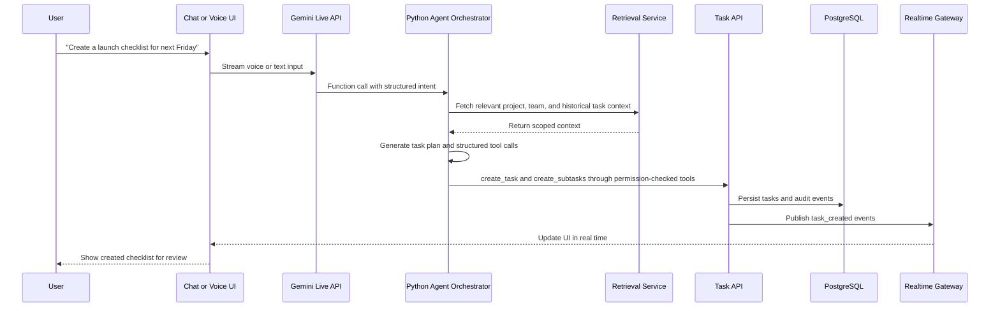
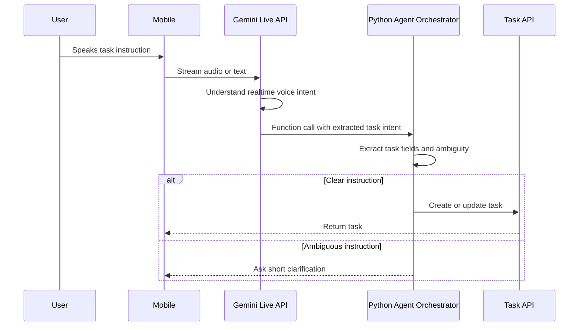
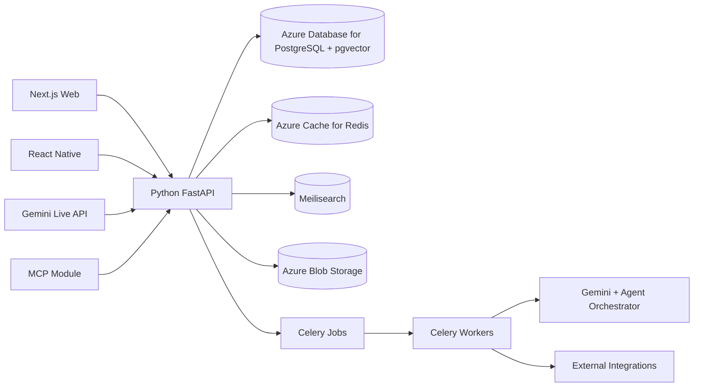

# AI Native Task Management SaaS - High-Level Architecture

## 1. Product Vision

Build a modern AI native task management SaaS where users can plan, execute, automate, and review work through a polished web app, mobile app, chat, voice, MCP-compatible clients, and custom AI agents.

The product should compete with tools like Asana, ClickUp, Linear, Motion, Todoist, Notion, and Monday.com by combining:

- Fast, intuitive task and project management.
- AI-first planning, summarization, prioritization, and automation.
- Real-time collaboration.
- Natural language task creation and updates.
- Voice-based task capture and task review.
- Extensible MCP server for AI clients, custom agents, and third-party assistants.
- Enterprise-grade security, auditability, permissions, and integrations.

## 2. Core Product Capabilities

- Workspaces, teams, projects, lists, boards, timelines, calendars, and dashboards.
- Tasks, subtasks, dependencies, priorities, labels, custom fields, attachments, comments, and activity history.
- AI planning assistant for turning goals, meetings, emails, and chat messages into structured work.
- AI prioritization based on deadlines, dependencies, workload, user preferences, and business context.
- Voice capture for creating, searching, summarizing, and updating tasks.
- MCP server exposing task management tools and resources to AI clients and agents.
- Custom AI agents for recurring workflows such as sprint planning, standups, inbox triage, follow-ups, and executive summaries.
- Integrations with Slack, Microsoft Teams, Google Workspace, Outlook, GitHub, GitLab, Jira, Linear, Notion, Zoom, and calendars.
- Notifications across web, mobile, email, push, Slack, and Teams.
- Analytics for productivity, workload, delivery risk, blocked work, and team health.

## 3. Recommended Tech Stack

The recommended stack is intentionally simple for the MVP: Python backend, PostgreSQL, Azure-managed infrastructure, Gemini for realtime natural-language interaction, and MCP as a controlled tool layer. Start with a modular monolith and split services only when scale or security boundaries require it.

### Frontend

| Area | Recommendation | Rationale |
| --- | --- | --- |
| Web app | Next.js with React and TypeScript | Strong SaaS foundation, routing, server rendering, ecosystem, and hiring pool |
| Mobile app | React Native with Expo | Fast mobile delivery with shared TypeScript models and good voice/capture support |
| UI system | Tailwind CSS, Radix UI, shadcn-style components | Fast iteration with accessible, composable UI primitives |
| State/data | TanStack Query, Zustand, React Hook Form, Zod | Predictable server state, lightweight local state, and type-safe forms |
| Realtime client | WebSocket client | Live task updates, comments, notifications, and presence |

### Backend

| Area | Recommendation | Rationale |
| --- | --- | --- |
| Backend API | Python with FastAPI | Simple, fast, type-friendly, and strong fit for AI-heavy products |
| Backend shape | Modular monolith | One deployable backend with clear modules for tasks, users, MCP, AI, notifications, integrations, billing, and admin |
| API style | REST APIs plus WebSocket | REST keeps product APIs simple; WebSocket supports realtime collaboration and notifications |
| MCP layer | Python MCP server/module inside the backend initially | Keeps MCP close to auth, permissions, audit logs, and task APIs; split later only if needed |
| Background jobs | Celery with Redis | Handles slow or retryable work such as AI processing, reminders, search indexing, notifications, and integration sync |
| Auth | Auth0, WorkOS, or Microsoft Entra External ID | Avoids building secure login, SSO, MFA, password reset, and enterprise identity from scratch |
| Billing | Stripe | Standard SaaS subscriptions, trials, invoices, and payment operations |

### Data

| Area | Recommendation | Rationale |
| --- | --- | --- |
| Primary database | Azure Database for PostgreSQL | Source of truth for organizations, users, projects, tasks, comments, permissions, audit logs, and billing references |
| Vector search | pgvector inside PostgreSQL | Supports semantic task/project retrieval without adding a separate vector database early |
| Cache and queue broker | Azure Cache for Redis | Cache, rate limits, presence, and Celery job broker/result backend |
| Search | Meilisearch on Azure Container Apps | Simple, fast, typo-tolerant product search for tasks, projects, and comments |
| Search later | Azure AI Search | Add later for enterprise-scale search, semantic ranking, document indexing, and advanced RAG pipelines |
| Object storage | Azure Blob Storage | Attachments, audio recordings, exports, imports, and generated files |
| Analytics later | Azure Synapse, Microsoft Fabric, or ClickHouse | Add after core product analytics requirements become clear |

### AI Platform

| Area | Recommendation | Rationale |
| --- | --- | --- |
| Realtime natural language | Gemini Live API | Low-latency voice/text interaction for natural user conversations |
| Tool calling | Gemini function calling | Lets Gemini convert natural language into controlled tool calls |
| Agent orchestration | Python service layer around Gemini and MCP tools | Keeps business rules, permissions, retries, and auditability inside your backend |
| Retrieval | Hybrid retrieval using PostgreSQL filters, pgvector, and Meilisearch | Combines exact workspace permissions with semantic and keyword search |
| Voice | Gemini Live API for realtime voice; store audio in Azure Blob Storage when needed | Reduces separate speech-to-text/text-to-speech infrastructure in the MVP |
| Guardrails | Tool permissions, policy checks, approval gates, and audit logs | Prevents unsafe autonomous changes and creates enterprise trust |
| Evaluation | Prompt/version registry, test conversations, AI traces, and user feedback | Required to improve AI reliability over time |

### Azure Infrastructure

| Area | Recommendation | Rationale |
| --- | --- | --- |
| Cloud | Azure | Chosen cloud platform for app hosting, data, storage, secrets, and monitoring |
| App hosting | Azure Container Apps | Good fit for FastAPI, Celery workers, Meilisearch, and containerized services without managing Kubernetes |
| Database | Azure Database for PostgreSQL | Managed PostgreSQL with backups, scaling, monitoring, and pgvector support |
| Redis | Azure Cache for Redis | Managed Redis for caching, Celery jobs, rate limits, and presence |
| File storage | Azure Blob Storage | Durable and cost-effective file/object storage |
| Secrets | Azure Key Vault | Central place for API keys, database credentials, and signing secrets |
| Observability | Azure Monitor, Application Insights, Sentry, OpenTelemetry | Logs, metrics, traces, frontend errors, and backend exceptions |
| CI/CD | GitHub Actions | Common, flexible deployment pipelines into Azure |
| CDN/edge later | Azure Front Door | Add later for production WAF, custom domains, TLS, global routing, caching, and edge protection |
| IaC later | Terraform or Bicep | Add once environments need repeatable provisioning |

Avoid Kubernetes, Kafka, Temporal, GraphQL, OpenSearch, and separate microservices in the MVP unless a clear requirement appears. These can be introduced later without changing the product experience if module boundaries and events are clean.

## 4. High-Level System Architecture

## 5. MCP Server Architecture

The MCP server should be a first-class product surface, not an afterthought. It allows external AI clients and custom agents to safely interact with the task platform.

Recommended MCP design principles:

- Every tool call must run through the same authorization and audit system as the main app.
- Destructive or broad changes should support human approval gates.
- Tool schemas should be strongly typed and versioned.
- MCP resources should expose context in small, permission-aware chunks.
- Agents should receive task IDs and stable references, not only free-form text.
- The MCP server should support workspace-scoped OAuth, personal access tokens, and service accounts.

## 6. AI Agent Design

Agents should be specialized, observable, and permissioned. Avoid one unrestricted agent that can do everything.

Initial agents to build:

- Task capture agent: converts chat, voice, email, and meeting notes into structured tasks.
- Daily planning agent: proposes the user's day based on due dates, priorities, meetings, and energy preferences.
- Project planning agent: breaks goals into milestones, tasks, dependencies, and owners.
- Standup agent: summarizes yesterday, today, blockers, and risks from activity.
- Follow-up agent: detects stale tasks, missing responses, and blocked dependencies.
- Workload agent: identifies over-allocation, under-utilization, and delivery risks.

## 7. Domain Data Model

Core entities:

- Organization
- Workspace
- Team
- User
- Membership
- Role
- Project
- View
- Task
- Subtask
- Dependency
- Comment
- Attachment
- ActivityEvent
- Notification
- Automation
- IntegrationConnection
- Agent
- AgentRun
- MCPToolCall
- AuditLog
- BillingAccount

Simplified model:

## 8. Key Request Flows

### Natural Language Task Creation

### Voice Task Capture

## 9. Security, Privacy, and Governance

- Use organization, workspace, project, and task-level authorization.
- Support RBAC initially; add ABAC for advanced enterprise rules.
- Enforce permissions consistently across UI, API, MCP, agents, integrations, and background jobs.
- Store audit logs for all task mutations, MCP tool calls, agent actions, permission changes, exports, and integration events.
- Encrypt data in transit and at rest.
- Keep customer data isolated by tenant using tenant IDs, row-level policies where useful, and strict query patterns.
- Add data retention controls, legal hold, export, and deletion workflows.
- Redact secrets and sensitive content from AI traces.
- Provide admin controls for disabling AI features, external model calls, MCP access, and specific integrations.
- Prepare for SOC 2 Type II, GDPR, CCPA, and enterprise SSO/SCIM requirements.

## 10. UX and Product Design Recommendations

To compete with mature task management products, the UI should feel fast, clear, and operationally useful.

Design principles:

- Make the task screen dense but calm: clear hierarchy, minimal decoration, fast inline editing.
- Support multiple views: list, board, calendar, timeline, workload, inbox, and command center.
- Use command palette and natural language input as primary power-user surfaces.
- Keep AI suggestions visible but non-intrusive; users should be able to accept, edit, dismiss, or explain suggestions.
- Use progressive disclosure for advanced fields and automation settings.
- Provide excellent empty states that let users create tasks immediately.
- Use real-time collaboration indicators, presence, and activity history.
- Make mobile optimized for capture, triage, notifications, and daily planning rather than full admin workflows.
- Build accessibility from the start: keyboard navigation, focus states, screen reader support, color contrast, and reduced motion.

High-value screens for MVP:

- Today / My Work
- Inbox
- Project list view
- Project board view
- Task detail panel
- AI command center
- Workspace search
- Automations
- Agent settings
- Integration settings
- Admin and billing

## 11. Scalability and Reliability

- Start with a modular monolith for the core API to move quickly.
- Split services only when scaling pressure is clear: realtime, AI orchestration, integrations, notifications, search indexing, and analytics are natural boundaries.
- Use event-driven updates for search indexing, notifications, analytics, and agent triggers.
- Use Celery for background jobs first; consider Temporal later only for complex durable workflows that need long-running state, compensation, and advanced retries.
- Cache high-read data such as user preferences, workspace config, permissions, and presence.
- Use read replicas for reporting-heavy workloads.
- Keep all task mutations idempotent where possible.
- Design APIs around stable IDs and event history to support offline/mobile sync later.

## 12. Suggested MVP Architecture

For the first serious product version, avoid over-splitting services.

Recommended MVP:

- Next.js web app.
- React Native Expo mobile app.
- Python backend using FastAPI.
- Azure Database for PostgreSQL with pgvector.
- Azure Cache for Redis.
- Azure Blob Storage.
- Meilisearch on Azure Container Apps.
- Celery workers with Azure Cache for Redis.
- Gemini Live API and Gemini function calling for realtime natural-language interaction.
- MCP server as a Python module inside the backend initially.
- Stripe billing.
- Auth0, WorkOS, or Microsoft Entra External ID for auth and SSO.
- Azure Monitor, Application Insights, Sentry, OpenTelemetry, and managed logs.

MVP service layout:

## 13. Phased Delivery Roadmap

### Phase 1: Core Task Product

- Auth, organizations, workspaces, teams, projects, tasks, comments, attachments.
- List and board views.
- Task detail panel.
- Search.
- Notifications.
- Billing foundation.

### Phase 2: AI Native Workflows

- Natural language task creation.
- AI task summarization.
- Project planning assistant.
- Daily planning assistant.
- Semantic search.
- AI traces and feedback.

### Phase 3: MCP and Agent Platform

- MCP server with read-only resources first.
- MCP tools for task creation and updates.
- Tool permission model and audit logs.
- Custom workspace agents.
- Human approval gates.

### Phase 4: Voice and Collaboration

- Voice capture.
- Voice task search and summaries.
- Realtime presence.
- Collaborative notes/specs attached to projects.
- Meeting-to-task workflows.

### Phase 5: Enterprise and Scale

- SSO, SCIM, advanced admin controls.
- SOC 2 readiness.
- Data retention and export controls.
- Advanced analytics.
- Integration marketplace.
- Multi-region strategy if required.

## 14. Key Architectural Decisions

| Decision | Recommendation |
| --- | --- |
| Initial backend shape | Modular monolith with clear internal boundaries |
| Primary database | PostgreSQL |
| AI architecture | Gemini Live API, Gemini function calling, and Python agent orchestration |
| MCP | Python backend module first, with strict auth, audit, and tool permissions |
| Background processing | Celery with Redis first; Temporal later only if workflows become complex |
| Realtime | WebSocket gateway, Redis presence, event fanout |
| Search | Meilisearch for product search, PostgreSQL pgvector for semantic retrieval, Azure AI Search later if needed |
| Mobile | React Native Expo |
| Auth | Managed auth provider early, enterprise SSO support |
| Deployment | Azure Container Apps first; Kubernetes only when team is ready |

## 15. Open Questions

- Is the initial target individual productivity, SMB teams, engineering teams, agencies, or enterprise operations?
- Should the product optimize for general task management or a specific wedge like AI project planning, AI executive assistant, or voice-first task capture?
- Is self-hosting or data residency required?
- Are AI features allowed to use external model providers for all customers, or is a private/VPC model path required?
- Which integrations are mandatory for launch?
- Should MCP be available to all users or restricted to paid/workspace-admin plans?

